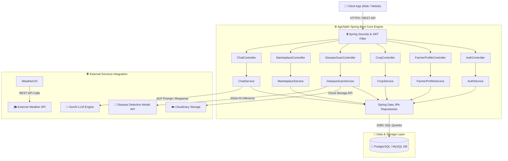
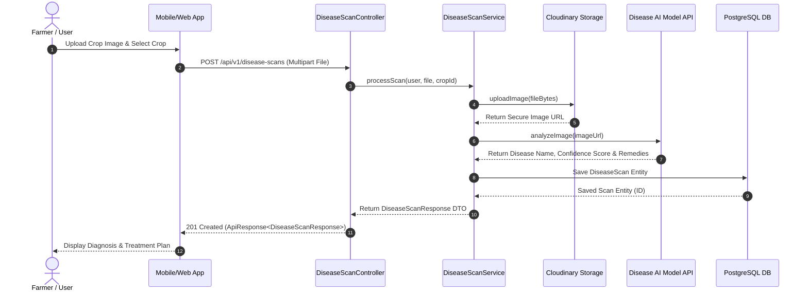
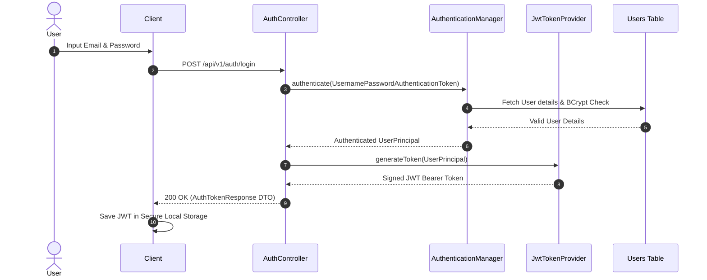

# 🏛️ AgriSathi AI — System Architecture & Component Design

**Version:** 1.0  
**Target Platform:** Cloud Native / On-Premise Microservice Ready  
**Core Framework:** Spring Boot 3.x (Java 21 LTS)  

---

## 1. High-Level Architecture Overview

AgriSathi AI is built on a **Layered Domain-Driven Enterprise Architecture** designed for high throughput, maintainability, and seamless scalability.

---

## 2. Data Flow Architecture

### 2.1. AI Crop Disease Scanning Flow

### 2.2. User Authentication & Authorization Flow

---

## 3. Core Component Layers

### 3.1. Web & Security Controller Layer
- Implements strict request validation via `@Valid` annotations and Jakarta Bean Validation constraints.
- Wraps all API responses within a unified `ApiResponse<T>` envelope for standard front-end processing.
- Handles stateless request authentication via custom `JwtAuthenticationFilter`.

### 3.2. Service & Business Domain Layer
- Contains transactional business logic marked with `@Transactional`.
- Decouples domain models from REST request payloads using custom/MapStruct DTO mappers.
- Handles error boundaries by throwing custom runtime exceptions (`ResourceNotFoundException`, `BadRequestException`, `UnauthorizedException`).

### 3.3. Persistence & Repository Layer
- Leverages Spring Data JPA for type-safe repository patterns.
- Includes custom JPQL and native SQL queries optimized with database indexes (`idx_users_email`, `idx_crops_user`, `idx_scans_user`).

---

## 4. Non-Functional Requirements & System Guarantees

| Requirement | Implementation & Metric |
| :--- | :--- |
| **Statelessness** | Zero HTTP session persistence. All client requests carry authorization headers. |
| **Performance** | Database connection pooling via HikariCP (`maximum-pool-size=10`). |
| **Security** | BCrypt password hash strength of 10 rounds; CORS restricted to verified web domains. |
| **Data Integrity** | Cascade policies and foreign key constraints on relational schemas. |
| **Observability** | Centralized exception handling via `GlobalExceptionHandler` with structured timestamps. |
