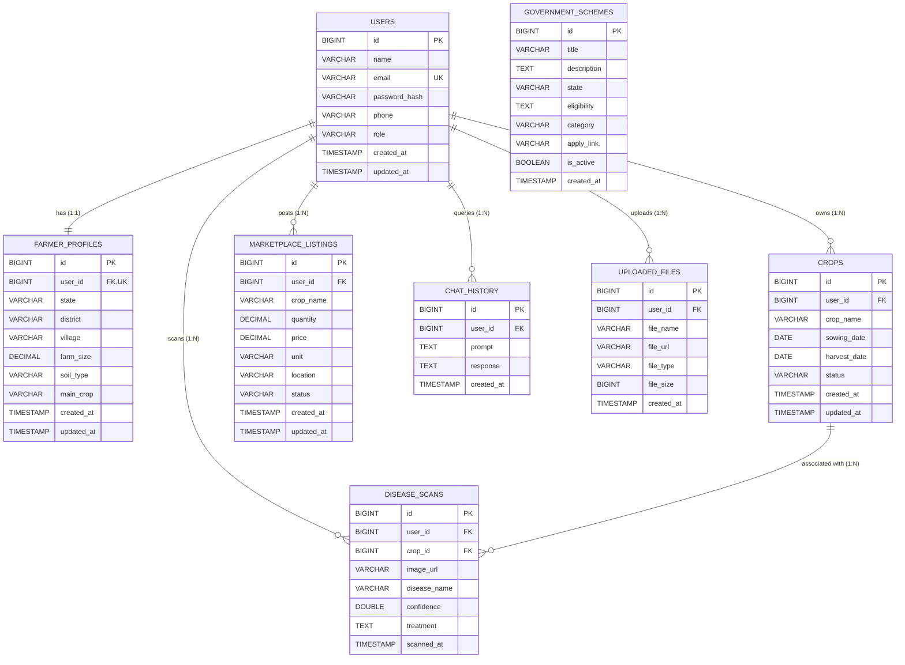

# AgriSathi AI - Database Schema Documentation

**Version:** 1.0  
**Database Engine:** PostgreSQL 15+ / MySQL 8.0+ (JPA / Hibernate Compatible)  
**ORM Framework:** Spring Data JPA / Hibernate  

---

## 1. Entity Relationship (ER) Diagram

---

## 2. Table Specifications & Field Descriptions

### 2.1. `users` Table
Stores authentication and basic user profile information.

| Column | Data Type | Constraints | Description |
| :--- | :--- | :--- | :--- |
| `id` | `BIGINT` | `PRIMARY KEY`, `AUTO_INCREMENT` | Unique Identifier |
| `name` | `VARCHAR(100)` | `NOT NULL` | Full Name |
| `email` | `VARCHAR(150)` | `NOT NULL`, `UNIQUE` | User Email (Used for Login) |
| `password_hash` | `VARCHAR(255)` | `NOT NULL` | BCrypt Encrypted Password Hash |
| `phone` | `VARCHAR(15)` | `NOT NULL` | 10-digit Phone Number |
| `role` | `VARCHAR(20)` | `DEFAULT 'ROLE_USER'` | Access Role (`ROLE_USER`, `ROLE_ADMIN`) |
| `created_at` | `TIMESTAMP` | `DEFAULT CURRENT_TIMESTAMP` | Account Creation Timestamp |
| `updated_at` | `TIMESTAMP` | `DEFAULT CURRENT_TIMESTAMP ON UPDATE` | Record Modification Timestamp |

*Indexes:*
- `idx_users_email` (`email`) - Fast lookup for authentication.

---

### 2.2. `farmer_profiles` Table
Stores extended farm/location metadata for personalized recommendations.

| Column | Data Type | Constraints | Description |
| :--- | :--- | :--- | :--- |
| `id` | `BIGINT` | `PRIMARY KEY`, `AUTO_INCREMENT` | Unique Identifier |
| `user_id` | `BIGINT` | `NOT NULL`, `UNIQUE`, `FK -> users(id)` | Foreign Key to User (1:1 Relationship) |
| `state` | `VARCHAR(100)` | `NOT NULL` | Indian State (e.g., Uttarakhand) |
| `district` | `VARCHAR(100)` | `NOT NULL` | District (e.g., Dehradun) |
| `village` | `VARCHAR(100)` | `NULLABLE` | Village / Town Name |
| `farm_size` | `DECIMAL(8,2)` | `NOT NULL` | Farm area in Acres/Hectares |
| `soil_type` | `VARCHAR(50)` | `NOT NULL` | Soil Classification (e.g., Loamy, Clay) |
| `main_crop` | `VARCHAR(100)` | `NOT NULL` | Primary Cultivated Crop |
| `created_at` | `TIMESTAMP` | `DEFAULT CURRENT_TIMESTAMP` | Profile Creation Timestamp |
| `updated_at` | `TIMESTAMP` | `DEFAULT CURRENT_TIMESTAMP ON UPDATE` | Profile Update Timestamp |

*Indexes:*
- `idx_farmer_user` (`user_id`) - 1:1 direct join optimization.

---

### 2.3. `crops` Table
Manages farmer's active and historical crops.

| Column | Data Type | Constraints | Description |
| :--- | :--- | :--- | :--- |
| `id` | `BIGINT` | `PRIMARY KEY`, `AUTO_INCREMENT` | Crop Record ID |
| `user_id` | `BIGINT` | `NOT NULL`, `FK -> users(id)` | Owner Farmer ID |
| `crop_name` | `VARCHAR(100)` | `NOT NULL` | Name of the Crop |
| `sowing_date` | `DATE` | `NOT NULL` | Date when seeds were sown |
| `harvest_date` | `DATE` | `NULLABLE` | Expected / Actual Harvest Date |
| `status` | `VARCHAR(20)` | `DEFAULT 'PLANTED'` | Status (`PLANTED`, `HARVESTED`, `FAILED`) |
| `created_at` | `TIMESTAMP` | `DEFAULT CURRENT_TIMESTAMP` | Record Creation Timestamp |
| `updated_at` | `TIMESTAMP` | `DEFAULT CURRENT_TIMESTAMP ON UPDATE` | Record Update Timestamp |

*Indexes:*
- `idx_crops_user` (`user_id`) - Retrieve all crops for a user.

---

### 2.4. `disease_scans` Table
Records AI crop disease detection requests and diagnostic results.

| Column | Data Type | Constraints | Description |
| :--- | :--- | :--- | :--- |
| `id` | `BIGINT` | `PRIMARY KEY`, `AUTO_INCREMENT` | Scan History ID |
| `user_id` | `BIGINT` | `NOT NULL`, `FK -> users(id)` | User who submitted image |
| `crop_id` | `BIGINT` | `NULLABLE`, `FK -> crops(id)` | Associated Crop (Optional) |
| `image_url` | `VARCHAR(500)` | `NOT NULL` | Cloud Storage / Cloudinary Image URL |
| `disease_name` | `VARCHAR(150)` | `NOT NULL` | Detected Disease Label |
| `confidence` | `DOUBLE` | `NOT NULL` | Model Prediction Confidence % (e.g., 98.2) |
| `treatment` | `TEXT` | `NOT NULL` | Recommended Treatment Protocol |
| `scanned_at` | `TIMESTAMP` | `DEFAULT CURRENT_TIMESTAMP` | Timestamp of Scan |

*Indexes:*
- `idx_scans_user` (`user_id`, `scanned_at DESC`) - Optimized for historical scan lookups.

---

### 2.5. `marketplace_listings` Table
Stores produce listings created by farmers for direct buyer purchasing.

| Column | Data Type | Constraints | Description |
| :--- | :--- | :--- | :--- |
| `id` | `BIGINT` | `PRIMARY KEY`, `AUTO_INCREMENT` | Listing ID |
| `user_id` | `BIGINT` | `NOT NULL`, `FK -> users(id)` | Seller User ID |
| `crop_name` | `VARCHAR(100)` | `NOT NULL` | Crop / Produce Name |
| `quantity` | `DECIMAL(10,2)` | `NOT NULL` | Quantity Available |
| `price` | `DECIMAL(10,2)` | `NOT NULL` | Price per Unit in INR |
| `unit` | `VARCHAR(20)` | `NOT NULL` | Unit of Measurement (`kg`, `quintal`, `ton`) |
| `location` | `VARCHAR(150)` | `NOT NULL` | Pickup Location / City |
| `status` | `VARCHAR(20)` | `DEFAULT 'AVAILABLE'` | Listing Status (`AVAILABLE`, `SOLD`, `CANCELLED`) |
| `created_at` | `TIMESTAMP` | `DEFAULT CURRENT_TIMESTAMP` | Creation Date |
| `updated_at` | `TIMESTAMP` | `DEFAULT CURRENT_TIMESTAMP ON UPDATE` | Update Date |

*Indexes:*
- `idx_marketplace_user` (`user_id`) - Retrieve seller's active listings (`my-listings`).
- `idx_marketplace_status_crop` (`status`, `crop_name`) - Marketplace browse & filter queries.

---

### 2.6. `chat_history` Table
Stores conversational context for the AI Assistant endpoint.

| Column | Data Type | Constraints | Description |
| :--- | :--- | :--- | :--- |
| `id` | `BIGINT` | `PRIMARY KEY`, `AUTO_INCREMENT` | Conversation Entry ID |
| `user_id` | `BIGINT` | `NOT NULL`, `FK -> users(id)` | User ID |
| `prompt` | `TEXT` | `NOT NULL` | User Input Question |
| `response` | `TEXT` | `NOT NULL` | AI Assistant Response |
| `created_at` | `TIMESTAMP` | `DEFAULT CURRENT_TIMESTAMP` | Chat Timestamp |

---

### 2.7. `government_schemes` Table
Stores curated government schemes filtered by State and Category.

| Column | Data Type | Constraints | Description |
| :--- | :--- | :--- | :--- |
| `id` | `BIGINT` | `PRIMARY KEY`, `AUTO_INCREMENT` | Scheme ID |
| `title` | `VARCHAR(200)` | `NOT NULL` | Scheme Title |
| `description` | `TEXT` | `NOT NULL` | Detailed Scheme Summary |
| `state` | `VARCHAR(100)` | `NOT NULL` | Applicable State or `ALL` |
| `eligibility` | `TEXT` | `NULLABLE` | Qualification Rules |
| `category` | `VARCHAR(100)` | `NULLABLE` | Subsidy Type / Category |
| `apply_link` | `VARCHAR(500)` | `NULLABLE` | Portal Application Link |
| `is_active` | `BOOLEAN` | `DEFAULT TRUE` | Active Flag |
| `created_at` | `TIMESTAMP` | `DEFAULT CURRENT_TIMESTAMP` | Entry Timestamp |

*Indexes:*
- `idx_schemes_state` (`state`, `is_active`) - Quick lookup by user state.

---

### 2.8. `uploaded_files` Table
Tracks files uploaded to third-party file storage (e.g. Cloudinary).

| Column | Data Type | Constraints | Description |
| :--- | :--- | :--- | :--- |
| `id` | `BIGINT` | `PRIMARY KEY`, `AUTO_INCREMENT` | File Record ID |
| `user_id` | `BIGINT` | `NOT NULL`, `FK -> users(id)` | Uploader ID |
| `file_name` | `VARCHAR(255)` | `NOT NULL` | Original File Name |
| `file_url` | `VARCHAR(500)` | `NOT NULL` | CDN Public Access URL |
| `file_type` | `VARCHAR(50)` | `NOT NULL` | MIME Type (e.g. `image/png`) |
| `file_size` | `BIGINT` | `NOT NULL` | Size in Bytes |
| `created_at` | `TIMESTAMP` | `DEFAULT CURRENT_TIMESTAMP` | Upload Time |

---

## 3. Key Relationships & Integrity Constraints

1. **User - Profile (`1 : 1`)**:
   - `farmer_profiles.user_id` has a `UNIQUE` constraint and `ON DELETE CASCADE`.
2. **User - Crops (`1 : N`)**:
   - One farmer can track multiple crops. Deleting a user removes their crop entries (`ON DELETE CASCADE`).
3. **User - Marketplace Listings (`1 : N`)**:
   - `marketplace_listings.user_id` links directly to seller accounts. Ownership checks enforce that only the creator can `PUT`/`DELETE` their listing.
4. **User - Disease Scans (`1 : N`)**:
   - Historical scans are preserved for analytics and crop diagnostic histories.
