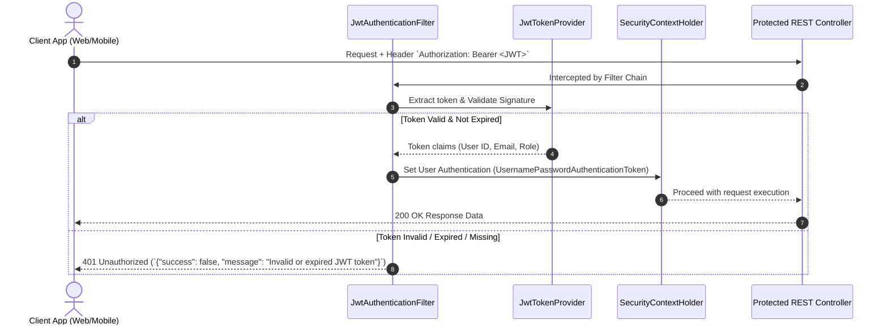

# AgriSathi AI - Security & Authentication Specifications

**Version:** 1.0  
**Security Framework:** Spring Security 6.x (Spring Boot 3.x)  
**Authentication Standard:** Stateless JWT (JSON Web Token)  
**Encryption:** BCrypt Password Hashing (Strength 12)  

---

## 1. JWT Authentication Flow

### 1.1. Flow Architecture Diagram



### 1.2. JWT Configuration & Token Structure
- **Algorithm:** HMAC-SHA512 (`HS512`)
- **Token Type:** `Bearer`
- **Expiration Time:** 1800 seconds (30 Minutes)
- **Token Payload Claims:**
  ```json
  {
    "sub": "user_id_12345",
    "email": "nick@gmail.com",
    "roles": ["ROLE_USER"],
    "iat": 1785230000,
    "exp": 1785231800
  }
  ```

---

## 2. Role-Based Access Control (RBAC) Matrix

| Endpoint | Method | Public / Anonymous | Authenticated User (`ROLE_USER`) | Admin (`ROLE_ADMIN`) |
| :--- | :--- | :---: | :---: | :---: |
| `/api/v1/auth/register` | `POST` | ✅ | ✅ | ✅ |
| `/api/v1/auth/login` | `POST` | ✅ | ✅ | ✅ |
| `/api/v1/auth/me` | `GET` | ❌ | ✅ | ✅ |
| `/api/v1/farmer/profile` | `PUT` / `GET` | ❌ | ✅ | ✅ |
| `/api/v1/crops/**` | `GET` / `POST` / `PUT` / `DELETE` | ❌ | ✅ (Owned Records Only) | ✅ |
| `/api/v1/disease/scan` | `POST` | ❌ | ✅ | ✅ |
| `/api/v1/disease/history` | `GET` | ❌ | ✅ | ✅ |
| `/api/v1/weather` | `GET` | ❌ | ✅ | ✅ |
| `/api/v1/recommendations/**` | `POST` | ❌ | ✅ | ✅ |
| `/api/v1/chat` | `POST` | ❌ | ✅ | ✅ |
| `/api/v1/marketplace/listings` | `GET` | ✅ | ✅ | ✅ |
| `/api/v1/marketplace/listings` | `POST` / `PUT` / `DELETE` | ❌ | ✅ (Owned Listings Only) | ✅ |
| `/api/v1/government-schemes` | `GET` | ✅ | ✅ | ✅ |
| `/api/v1/files/upload` | `POST` | ❌ | ✅ | ✅ |

---

## 3. Rate Limiting Policy

Rate limiting is enforced at the Gateway / Controller layer using **Bucket4j** (or Redis Token Bucket) to prevent DDoS and brute-force attacks.

| Tier / Endpoint Category | Max Requests | Window | Key Strategy | Exceeded Response |
| :--- | :--- | :--- | :--- | :--- |
| **Authentication (`/auth/login`, `/auth/register`)** | 10 requests | 1 minute | Client IP Address | `429 Too Many Requests` |
| **AI Disease Scan (`/disease/scan`)** | 15 requests | 1 minute | Authenticated User ID | `429 Too Many Requests` |
| **AI Chat Assistant (`/chat`)** | 20 requests | 1 minute | Authenticated User ID | `429 Too Many Requests` |
| **General Read APIs (`/crops`, `/schemes`)** | 100 requests | 1 minute | Authenticated User ID / IP | `429 Too Many Requests` |

---

## 4. CORS (Cross-Origin Resource Sharing) Configuration

Spring Security Web MVC CORS rules:
- **Allowed Origins:** `http://localhost:3000`, `http://localhost:5173`, `https://agrisathi-ai.com`
- **Allowed Methods:** `GET`, `POST`, `PUT`, `DELETE`, `OPTIONS`
- **Allowed Headers:** `Authorization`, `Content-Type`, `X-Requested-With`, `Accept`
- **Exposed Headers:** `Authorization`
- **Allow Credentials:** `true`
- **Max Age:** 3600 seconds (1 Hour)

---

## 5. Input Validation Rules

Jakarta Validation (`@Valid`, `@Validated`) is enforced on all Request DTOs:

| Field | Rule / Annotation | Pattern / Detail | Error Message |
| :--- | :--- | :--- | :--- |
| `email` | `@NotBlank`, `@Email` | Valid RFC 5322 syntax | `"Must be valid email format"` |
| `password` | `@NotBlank`, `@Size(min=8)`, `@Pattern` | Must contain 1 uppercase, 1 lowercase, 1 digit, 1 special character | `"Password must be at least 8 characters with upper, lower, number & special char"` |
| `phone` | `@NotBlank`, `@Pattern` | Exactly 10 digits (`^[0-9]{10}$`) | `"Phone number must be exactly 10 digits"` |
| `cropName` | `@NotBlank`, `@Size(max=100)` | Max 100 characters | `"Crop name maximum 100 characters"` |
| `farmSize` | `@NotNull`, `@Positive` | Decimal number > 0 | `"Farm size must be greater than 0"` |

---

## 6. Secure File Upload Rules (`/api/v1/disease/scan` & `/api/v1/files/upload`)

1. **Allowed Extensions:** `.jpg`, `.jpeg`, `.png`, `.webp` (MIME Types: `image/jpeg`, `image/png`, `image/webp`).
2. **Magic Byte Verification:** Inspect file headers (magic bytes) to verify true image content, preventing executable file upload (`.exe`, `.sh`, `.php`, etc.).
3. **Maximum File Size:** 5MB per upload.
4. **Filename Sanitization:** Uploaded files are renamed using randomly generated UUIDs (e.g. `uuid-8f92b.png`) to prevent directory traversal and overwrite attacks.
5. **Storage Isolation:** Files uploaded directly to Cloudinary / AWS S3; local execution rights disabled.

---

## 7. Global Exception & Error Handling Protocol

All thrown application exceptions are captured by a `@ControllerAdvice` / `@RestControllerAdvice` class (`GlobalExceptionHandler`) to ensure sensitive stack traces are **never** exposed to the client.

```json
{
  "success": false,
  "message": "Validation Failed",
  "errors": [
    "Password must contain at least one special character",
    "Phone number must be exactly 10 digits"
  ],
  "timestamp": "2026-07-28T15:45:21"
}
```

---

## 8. Security Checklist

- [x] Passwords hashed with BCrypt (Strength 12) before database persistence.
- [x] JWT signature validated on every incoming request via custom Spring Filter.
- [x] Database queries handled via Spring Data JPA Parameterized Queries (100% protection against SQL Injection).
- [x] Input payloads sanitized and validated via JSR-380 annotations to avoid XSS.
- [x] Stateless session management (`SessionCreationPolicy.STATELESS`).
- [x] Ownership validation on `PUT`/`DELETE` operations (`listing.user.id == currentUser.id`).
- [x] API Key and JWT secrets externalized into environment variables (`application.yml` referencing `${JWT_SECRET}`).
- [x] Production deployment restricted to HTTPS / TLS 1.3 only.
